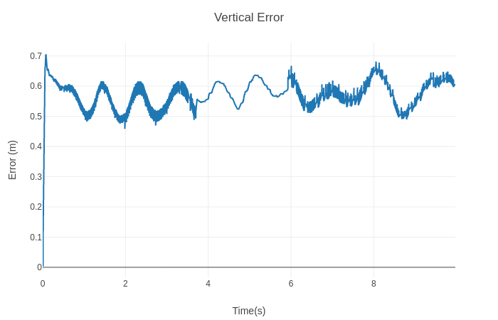
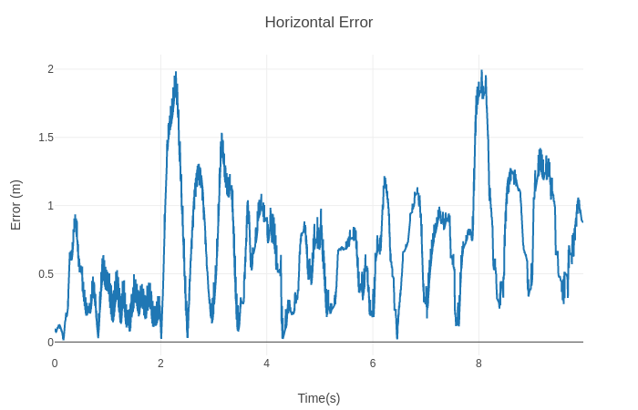
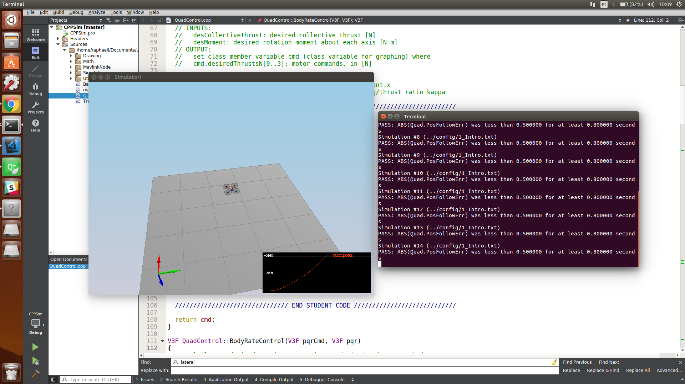
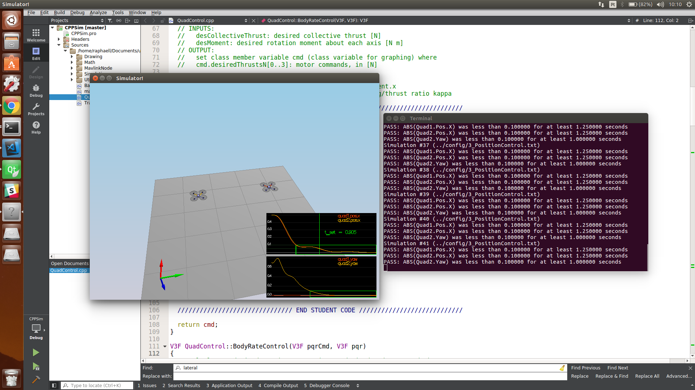
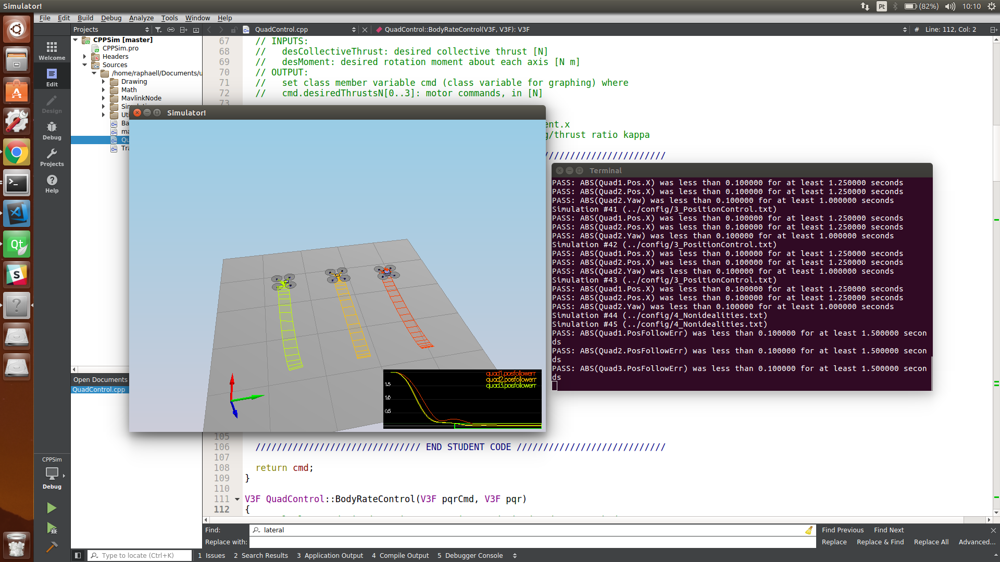
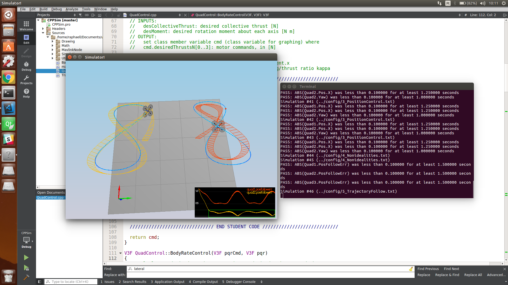

# FCND - Term 1/project 3

## Author: Raphaell Maciel de Sousa

# Implemented Controller - 3D controller
Next, we will implement the controller for the drone which will be able to control it in the 3D environment. 
From lesson, you are already familiar with the architecture of the controller. It consists of altitude controller, position controller, and attitude controller. 


The attitude controller breaks down into smaller controllers responsible for roll-pitch, yaw, and body rate. 

Parameters which will be required to create the controller are:
 - Altitude controller: $k_{p-z}$, $k_{d-z}$
 - Position controller: $k_{p-x}$, $k_{d-x}$, $k_{p-y}$, $k_{d-y}$
 - Roll-Pitch controller: $k_{p-roll}$, $k_{p-pitch}$
 - Yaw controller: $k_{p-yaw}$
 - Body rate controller: $k_{p-p}$, $k_{p-q}$, $k_{p-r}$
 
Based on input parameters we also can calculate $\delta$ and $\omega_n$ for altitude $z$ and lateral controls $x$ and $y$.

## Implemented body rate control in python and C++

Body-rate constrol consists in a proportional controller as follow:

$p_{\text{error}} = p_c - p$

$\bar{u}_p= k_{p-p} p_{\text{error}}$

$q_{\text{error}} = q_c - q$

$\bar{u}_q= k_{p-q} q_{\text{error}}$

$r_{\text{error}} = r_c - r$

$\bar{u}_r= k_{p-r} r_{\text{error}}$

### Implementation

The implementations in python can be found in controller.py (lines 191-213). In C++ the controller is implemented in QuadControl.cpp (lines 111-137). 

In C++ it was required return the moments for each of the 3 axes. So, we used the Proportional controller to calculate the lateral acceleration as descrebed in the above equations, after all, we used moments of inertia to calculate the command moment as follow:

momentCmd = I * angular_acc;

## Implement roll pitch control in python and C++

The roll-pitch controller is a P controller responsible for commanding the roll and pitch rates ($p_c$ and $q_c$) in the body frame.  First, it sets the desired rate of change of the given matrix elements using a P controller. 

**Note** - subscript c means "commanded" and a means "actual"

$\dot{b}^x_c  = k_p(b^x_c - b^x_a)$

$\dot{b}^y_c  = k_p(b^y_c - b^y_a)$

where $b^x_a = R_{13}$ and $b^y_a = R_{23}$. The given values can be converted into the angular velocities into the body frame by the next matrix multiplication. 

$$
\begin{pmatrix} p_c \\ q_c \\ \end{pmatrix}  = \frac{1}{R_{33}}\begin{pmatrix} R_{21} & -R_{11} \\ R_{22} & -R_{12} \end{pmatrix} \times \begin{pmatrix} \dot{b}^x_c \\ \dot{b}^y_c  \end{pmatrix} 
$$

### Implementation

- python: lines 154-189
- C++: lines 140-201

## Implement altitude control in python

Linear acceleration can be expressed by the next linear equation
$$
\begin{pmatrix} \ddot{x} \\ \ddot{y} \\ \ddot{z}\end{pmatrix}  = \begin{pmatrix} 0 \\ 0 \\ g\end{pmatrix} + R \begin{pmatrix} 0 \\ 0 \\ c \end{pmatrix} 
$$

where $R = R(\psi) \times R(\theta) \times R(\phi)$. The individual linear acceleration has the form of 

$$
\begin{align}
\ddot{x} &= c b^x \\ 
\ddot{y} &= c b^y \\ 
\ddot{z} &= c b^z +g
\end{align}
$$ 
where $b^x = R_{13}$, $b^y= R_{23}$ and $b^z = R_{33}$ are the elements of the last column of the rotation matrix. 

We are controlling the vertical acceleration: 

$$\bar{u}_1 = \ddot{z} = c b^z +g$$ 

Therefore 

$$c = (\bar{u}_1-g)/b^z$$  


In this exercise a PD controller is used for the altitude which results in: 

$$\bar{u}_1 = k_{p-z}(z_{t} - z_{a}) + k_{d-z}(\dot{z}_{t} - \dot{z}_{a}) + \ddot{z}_t$$

### Implementation

python: lines 127-152

## Implement altitude controller in C++

In C++ we had to do some alterations in the control strategy to achieve the requiriments. First of all, we have a drone with different mass, so, the controller should provide more thrust to track the trajectory. But a controller tuned to provide more thrust, fail in another scenarios. So, we add the integral portion of the PID controller:


$$\bar{u}_1 = P + I + D + \ddot{z}_t$$

But the integral controller was not enough to achieve zero stead state error! So we used a different approach as descrived bellow.

### PID with adaptive incrmental gains

The idea of the implemented technic is increase or decrease the proportional gain as a function of the error signal. So, if the altitude error is bigger than a defined limit, we increment the proportional gain, so, the controller adjust becomes more "agressive", and the opposite happens if the error is small, we decrise the proportional gain. 

In C++ the approach can be found in lines 204-270. And the incremental gains strategy are in lines 235-245.

## Implement lateral position control in python and C++
The lateral controller will use a PD controller to command target values for elements of the drone's rotation matrix. The drone generates lateral acceleration by changing the body orientation which results in non-zero thrust in the desired direction. This will translate into the commanded rotation matrix elements $b^x_c$ and $b^y_c$. The control equations have the following form:

$$
\begin{align}
\ddot{x}_{\text{command}} &=  c b^x_c \\
\ddot{x}_{\text{command}} &=  k^x_p(x_t-x_a) + k_d^x(\dot{x}_t - \dot{x}_a)+ \ddot{x}_t \\
b^x_c &= \ddot{x}_{\text{command}}/c
\end{align}
$$

for the $y$ direction the control equations will have the same form as above.

### implementation

- Python: lines 94-125
- C++: lines 273-326

## Implement yaw control in python and C++

Control over yaw is decoupled from the other directions. A P controller is used to control the drone's yaw.

$r_c = k_p (\psi_t - \psi_a)$

### implementation

- Python: lines 215-227
- C++: lines 329-352

## Implement calculating the motor commands given commanded thrust and moments in C++


### Implementation

lines 63-109

# Controllers tuning

We used the lesson's equations to tunning our controllers:


```python
zeta = 0.75
omega = 3.5 #2.8 for altitude
T = 1/omega
T_rise = 1.57 * T

kp = (1/(T * T)) * (1 + 2 * zeta)
ki = 1/(T * T * T)
kd = (1/(T)) * (1 + 2 * zeta)

print("T_rise", T_rise)
print("Kp", kp)
print("Ki", ki)
print("Kd", kd)
```

    ('T_rise', 0.44857142857142857)
    ('Kp', 30.625000000000004)
    ('Ki', 42.87500000000001)
    ('Kd', 8.75)


So, choosing different values for zeta and omega it was possible fiding differents gains for the PID controller. But the general idea for tuning was chossing a faster action for attitude and a slower for another controllers. The fine tuning was relized by hand (Not easy!).

# Flight Evaluation

## Python results

It was not a easy task for me! But, figures bellow show the error signal in horizontal and vertical positions. It is possible notice that we achieve a error within the desired limits.




### C++ results






